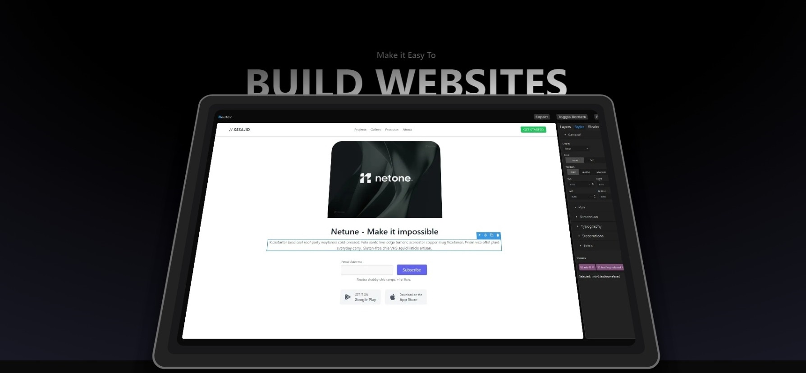

# Nautev: No-Code Web Builder

Nautev is a revolutionary no-code web-building platform that empowers users to create stunning websites without writing a single line of code. With Nautev, unleash your creativity and bring your ideas to life with ease.

## Key Features

- **Intuitive Drag-and-Drop Interface:** Build your website effortlessly by simply dragging and dropping elements onto the canvas.
- **Customizable Templates:** Choose from a wide range of professionally designed templates, customizable to suit your unique style and branding.
- **Responsive Design:** Ensure your website looks stunning on any device with Nautev's built-in responsiveness features.
- **No-Code Required:** Say goodbye to complex coding languages. Nautev simplifies the web-building process, allowing anyone to create beautiful websites regardless of their technical expertise.

## Getting Started

To get started with Nautev, simply go to [Nautev](https://nautev.vercel.app).

## Contributing

We welcome contributions from the community! If you have any ideas, bug fixes, or feature requests, feel free to open an issue or submit a pull request.

## License

This project is licensed under the [MIT License](LICENSE).
